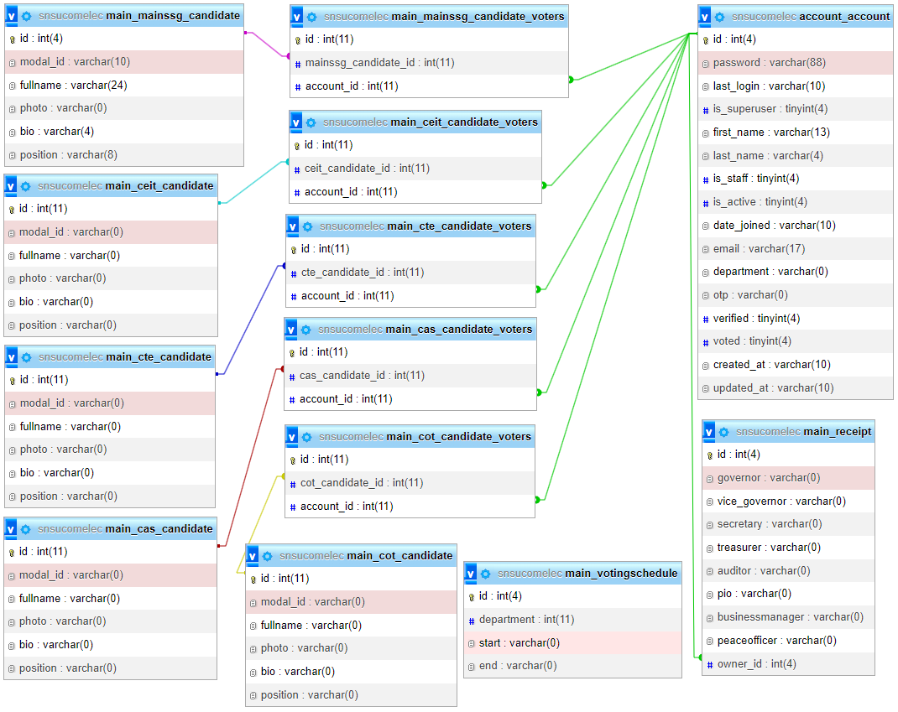

# E - Voting Created Using [Python - Django Framework]
This E - Voting System Was Developed By [Fermilan, Christian Jhegg](https://www.facebook.com/Donjheggo/) a Student @ [Surigao del Norte State University](https://snsu.edu.ph/)


If you like this project, please ADD a STAR ⭐️  to this project 👆

This automated voting system for institutions and/or organizations is implemented using the Django-built Voting System web application. The voting process is similar to the conventional election manual system in that the list of candidates and voters must be entered into the system. This e-voting system was made for a capstone project by a student. The user interface of the system has two parts: one for administrators and one for voters. The administrator is in charge of populating and managing the data of the system and the voter side, which is where the voters will choose their candidate and submit their votes.


[Front-end Template](https://startbootstrap.com/theme/sb-admin-2 "SB Admin 2")


## Features:

- [x] Vote preview
- [x] Multiple votes
- [x] Result tally
- [x] Print voting results in PDF
- [x] CRUD voters
- [x] CRUD candidates
- [x] CRUD positions

## A. Administrator Can
1. Set Election Schedule
2. See Overall Summary of Votes
3. Check Voters
4. Manage Candidates (CRUD)
5. Print Tally


## B. Voters Can
1. Register
2. Login
3. Verify with OTP (This can be overwritten in `settings.py` file)
4. Votes for their favourite candidates
5. View candidates they voted for

## 📸 ScreenShots
<figure>
  
  <figcaption>Database Design</figcaption>
</figure>


## Support Developer
1. Add a Star 🌟 to this 👆 Repository
2. Follow on Twitter/Github


### Pre-Requisites:
1. Install Git Version Control
[ https://git-scm.com/ ]

2. Install Python Latest Version
[ https://www.python.org/downloads/ ]

3. Install Pip (Package Manager)
[ https://pip.pypa.io/en/stable/installing/ ]

*Alternative to Pip is Homebrew*


### Installation
**1. Create a Folder where you want to save the project**

**2. Create a Virtual Environment and Activate**

Install Virtual Environment First
```
$  pip install virtualenv
```

Create Virtual Environment

For Windows
```
$  python -m venv venv
```
For Mac
```
$  python3 -m venv venv
```
For Linux
```
$  virtualenv .
```

Activate Virtual Environment

For Windows
```
$  source venv/scripts/activate
```

For Mac
```
$  source venv/bin/activate
```

For Linux
```
$  source bin/activate
```

**3. Clone this project**
```
$  git clone https://github.com/Donjheggo/OnlineVotingSystem.git
```

Then, Enter the project
```
$  cd snsucomelec
```

**4. Install Requirements from 'requirements.txt'**
```python
$  pip3 install -r requirements.txt
```

**5. Run migrations and migrate**
```python manage.py makemigrations```
```python manage.py migrate```

**6. Now Run Server**

Command for PC:
```python
$ python manage.py runserver
```

Command for Mac:
```python
$ python3 manage.py runserver
```

Command for Linux:
```python
$ python3 manage.py runserver
```

**7. Login Credentials**

Create Super User (HOD)
Command for PC:
```
$  python manage.py createsuperuser
```

Command for Mac:
```
$  python3 manage.py createsuperuser
```

Command for Linux:
```
$  python3 manage.py createsuperuser
```


Then Add Email and Password

**or Use Default Credentials**

*For HOD /SuperAdmin*
Email: admin@admin.com
Password: admin

*For Staff*
Email: staff@staff.com
Password: staff

*For Student*
Email: student@student.com
Password: student


## For Sponsor or Projects Enquiry
1. Email - christianjheggfer@gmail.com
2. LinkedIn - [donjheggo](https://www.linkedin.com/in/christian-jhegg-fermilan-216752222/)
2. Twitter - [donjheggo](https://www.facebook.com/Donjheggo)


## How the system works
Administrator is required to create candidates and set schedule. 
After doing this, the voters can vote based on his/her department

## How do voters get verified ?
OTP is sent to voter's email.
The OTP is sent via an python SMTP gateway. 

## Can OTP verification be bypassed ?
Yeah, sure.
Open `settings.py` and toggle `OTP` to  `False`
Then, wait till server restarts

## If OTP is True
Fill up the OTP_EMAIL and OTP_PASSWORD in settings.py
then go to your gmail settings and allow less secure apps for smtp to enable
tutorial - [How to Setup Gmail SMTP Server](https://www.youtube.com/watch?v=1YXVdyVuFGA)


## Open to contribution ?
Yeah. Pull requests are welcomed.

## Having any issue using this ?
Please, let us know. Open up an issue. 


